``` r
library(kableExtra)
library(arsenal)
library(lsa)
library(tidyverse)
library(NMF)
library(MutationalPatterns)
```

# Loading the data

We started by loading the sample information and the mutational context matrix for all the highly mutated samples:  


``` r
high_tmb_df <- read_csv("sample_info.csv")
mut_mat <- read.table("sbs_168.tsv", header=TRUE)
rownames(mut_mat) <- mut_mat$MutationType
mut_mat$MutationType <- NULL
summary(colSums(mut_mat))
```

```
##    Min. 1st Qu.  Median    Mean 3rd Qu.    Max. 
##   12.00   24.00   34.00   38.83   50.00  117.00
```


We perform an NMF analysis using up to `k=8`:


``` r
estimate <- nmf(mut_mat, rank = 2:8, method = "brunet", 
                nrun = 40, seed = 123456, .opt = "v-p")
```

```
## Compute NMF rank= 2  ... + measures ... OK
## Compute NMF rank= 3  ... + measures ... OK
## Compute NMF rank= 4  ... + measures ... OK
## Compute NMF rank= 5  ... + measures ... OK
## Compute NMF rank= 6  ... + measures ... OK
## Compute NMF rank= 7  ... + measures ... OK
## Compute NMF rank= 8  ... + measures ... OK
```

And plot the fitness of the rank.


``` r
plot(estimate, what=c("rss"))+
   theme_minimal()+
   theme(plot.title = element_blank(),
         strip.text.x = element_blank(),
         legend.position="none",
         axis.text.y = element_text(size=15),
         axis.text.x = element_text(size=15),
         axis.title.x = element_text(size=15),
         )
```

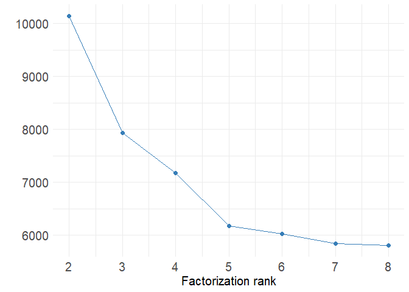<!-- -->

# Plotting and identifying the signature archetypes

Notice that the elbow on the RSS plot starts around 5-6, so after some experimentation we will settle for `k=6` and plot the mutational profiels


``` r
nmf_res <- extract_signatures(mut_mat, rank=6, nrun=40,
                              single_core=TRUE,seed = 123456)
```

```
## Runs: 1* 2* 3 4 5* 6 7 8 9 10* 11 12 13 14 15 16* 17 18 19 20 21 22 23 24 25 26 27 28 29 30 31 32 33 34 35 36 37 38 39 40 ... DONE
## System time:
##    user  system elapsed 
##   31.28    0.72   33.47
```

``` r
sig_names <- c("A","B","C","D","E","F")
colnames(nmf_res$signatures)=sig_names
rownames(nmf_res$contribution)=sig_names
plot_96_profile(nmf_res$signatures)
```

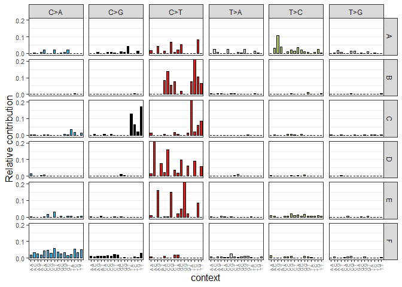<!-- -->

We change the order so they can better displayed


``` r
fixed_order = c("D", "B", "E","C","F","A")
nmf_res$signatures <-  nmf_res$signatures[,fixed_order]
nmf_res$contribution <- nmf_res$contribution[fixed_order,]

colnames(nmf_res$signatures)=sig_names
rownames(nmf_res$contribution)=sig_names
plot_96_profile(nmf_res$signatures)
```

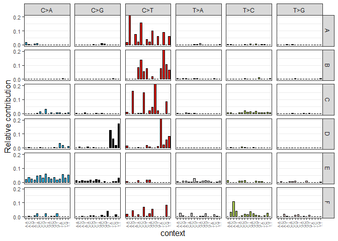<!-- -->

And we can plot the similarity against the COSMIC mutational signatures:


``` r
cosmic <- as.matrix(
  read.table('COSMIC_v3.2_SBS_GRCh37.txt', header=TRUE)[,-1])
cos_sim_samples_signatures <- 
  cos_sim_matrix(nmf_res$signatures, cosmic)

plot_cosine_heatmap(cos_sim_samples_signatures, cluster_cols=TRUE)
```

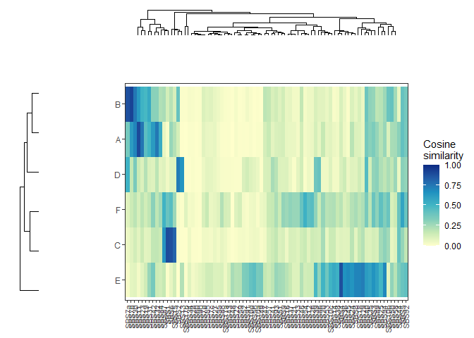<!-- -->

Now we repeat the plots using more informative names


``` r
full_names=c("TMZ","UV","dMMR","APOBEC","Tobacco","Unknown")
colnames(nmf_res$signatures)=full_names
rownames(nmf_res$contribution)=full_names
```

Which brings us to figure 1


``` r
row_di=(
  c("A.A","","A.G","","C.A","","C.G","",
    "G.A","","G.G","", "T.A","","T.G",""))
omit_di <- rep(row_di,4)


(fig1a <- plot_96_profile(nmf_res$signatures)+
   scale_x_discrete(labels=omit_di)+
   theme(strip.text.y = element_text(angle = 0,size=15),
         strip.text.x = element_text(angle = 0,size=15),
         axis.title.x = element_text(size=15),
         axis.title.y = element_text(size=15),
         axis.text.x  = element_text(size=10, angle=90),
        legend.position = "none"))
```

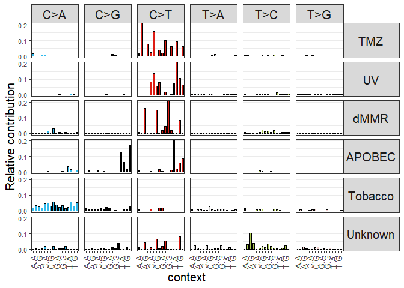<!-- -->

And this should go be supp 2


``` r
cos_sim_samples_signatures <-
  cos_sim_matrix(nmf_res$signatures, cosmic[,1:27])

plot_cosine_heatmap(cos_sim_samples_signatures, cluster_cols=TRUE) 
```

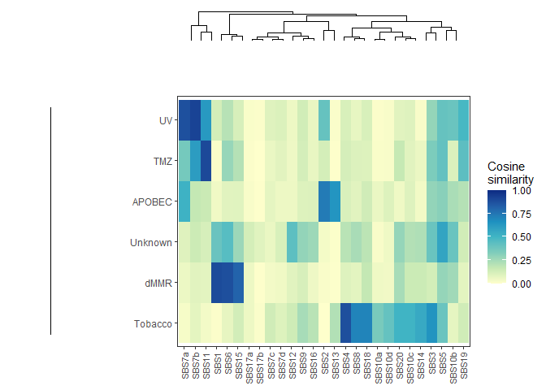<!-- -->

Notice the cosine similarities for:

* APOBEC: To `SBS2` and `SBS13`

``` r
round(cos_sim_samples_signatures[4,c("SBS2","SBS13")],2)
```

```
##  SBS2 SBS13 
##  0.74  0.65
```

Notice that it is very close to the sum of signatures 2 and 13


``` r
apobec <- cosmic[,"SBS2"] + cosmic[,"SBS13"]
round(cosine(
  as.matrix(cbind(apobec, nmf_res$signatures[,4])))[1,2],2)
```

```
## [1] 0.97
```


* Tobacco 


``` r
round(cos_sim_samples_signatures[5,c("SBS4")],2)
```

```
## [1] 0.88
```

* MMR


``` r
round(cos_sim_samples_signatures[3,c("SBS1","SBS6","SBS15")],2)
```

```
##  SBS1  SBS6 SBS15 
##  0.90  0.88  0.82
```

And here we combined a couple of them


``` r
dMMR <- cosmic[,"SBS6"] + cosmic[,"SBS1"] + cosmic[,"SBS15"]
round(cosine(
  as.matrix(cbind(dMMR, nmf_res$signatures[,3])))[1,2],2)
```

```
## [1] 0.96
```


* UV

``` r
round(cos_sim_samples_signatures[2,c("SBS7a","SBS7b")],2)
```

```
## SBS7a SBS7b 
##  0.88  0.92
```

And a higher similarity to the linear combination of `SBS7a` and `SBS7b`:

``` r
uv <- cosmic[,"SBS7a"] + cosmic[,"SBS7b"]
round(cosine(
  as.matrix(cbind(uv, nmf_res$signatures[,2])))[1,2],2)
```

```
## [1] 0.97
```

* TMZ


``` r
round(cos_sim_samples_signatures[1,c("SBS11")],2)
```

```
## [1] 0.9
```

* Aging/Unknown


``` r
which.max(cos_sim_samples_signatures[6,])
```

```
## SBS5 
##    5
```

``` r
round(cos_sim_samples_signatures[6,c("SBS5")],2)
```

```
## [1] 0.58
```

``` r
#Let's see how flat it is
flat <- rep (1/96,96)
round(cosine(
  as.matrix(cbind(nmf_res$signatures[,6], flat)))[1,2],2)
```

```
## [1] 0.5
```


# Plotting sample decomposition

Now let's look at things according to the samples. We will plot signature contribution and do some hierarchical clustering. We start by creating a function that given an nmf object, returns the sample percentual contribution from each mutational signature:


``` r
library(ComplexHeatmap)
library(circlize)
library(RColorBrewer)

get_pct_sig <- function(nmf_res) {
  contribution <- t(nmf_res$contribution)
  contribution_norm <- contribution / rowSums(contribution)

  return(contribution_norm)  
}
```

Now we will create a function that given the matrix of mutational signature contributions, plots this matrix as a heatmap dividing into a particular number of clusters


``` r
plot_sig_heatmap <- function(pct_matrix, numclusters, 
                             labels, cluster_method="complete"){

    contribution_palette=colorRampPalette(brewer.pal(n = 9, name = "YlGnBu"))(50)
    Heatmap(pct_matrix, 
           clustering_method_rows = cluster_method,
           row_split=numclusters,
           show_row_names=FALSE,
           row_gap = unit(4, "mm"),
           row_title = labels,
           row_title_rot = 0,
           name='Relative\ncontribution',

           cluster_columns=FALSE,
           col = contribution_palette,
           column_names_rot = 0,
           column_names_centered = TRUE,
           border=TRUE)

}
```

We will test our function using 6 clusters and add labels for each of the clusters


``` r
numclusters=6
cluster_method="ward.D2"
contribution_mat <- get_pct_sig(nmf_res)
cluster_labels =
  c("TMZ-high", "UV-high","dMMR-high",
    "APOBEC-high","Tobacco-high", "Miscellaneous")

set.seed(321)
plot_sig_heatmap(contribution_mat,numclusters,
                 cluster_labels,cluster_method)
```

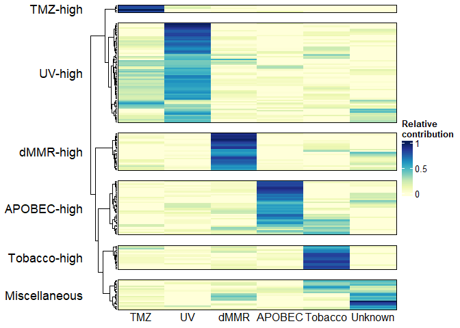<!-- -->

We will extend our function by including additional tracks representing the MsI status and the tissue of origin:


``` r
plot_ext_sig_heatmap <- function(pct_matrix, numclusters, 
                                 labels, sample_tbl,
                                 cluster_method="complete"){

    contribution_palette=
      colorRampPalette(brewer.pal(n = 9, name = "YlGnBu"))(50)
    MSI_color <-  brewer.pal(n=3,name="Greens")
    names(MSI_color) <- c("MSS","MSI-L","MSI-H")
    
    MUP_color <- brewer.pal(n=4, name="Pastel2")
    
    names(MUP_color) = rev(c('Soft T. Sarc. NOS', 
                             'Sal. gland. NOS',
                             'Mel. Unk. Prim.', 'Other'))
    
    tissue_names <- levels(sample_tbl$origin)
    tissue_color<-colorRampPalette(
      brewer.pal(n =length(tissue_names)-1, 
      name = "Set3"))(length(tissue_names))
    names(tissue_color) <- tissue_names
    
    annotation <- rowAnnotation(`MSI\nstatus`=sample_tbl$MSI,
                                 `Tissue\norigin`=
                                  sample_tbl$origin,
                                 `Selected\nDiagnosis\n`=
                                  sample_tbl$other.dx,
                                 col=list(`MSI\nstatus`=
                                            MSI_color,
                                      `Tissue\norigin`=
                                        tissue_color,                                                     `Selected\nDiagnosis\n`=
                                        MUP_color),
                                 simple_anno_size = unit(1, "cm"),
                                 annotation_name_gp=
                                  gpar(fontsize = 12),
                                 annotation_name_rot =0,
                                 gap=unit(0.7,"cm"))
        
    Heatmap(pct_matrix, 
           clustering_method_rows = cluster_method,
           row_split=numclusters,
           show_row_names=FALSE,
           cluster_columns=FALSE,
           col = contribution_palette,
           column_names_rot = 0,
           column_names_centered = TRUE,
           column_title = "Mutational Signature Contribution", 
           column_title_side = "bottom",
           
           row_gap = unit(4, "mm"),
           row_title = labels,
           row_title_rot = 0,
           border=TRUE,
           name='Percent\nmutational\nsignature',
           
           right_annotation=annotation
    )
  
}
```

And let's use our function to create our Figure 1B:


``` r
tissue_tbl <- high_tmb_df %>%
  filter(primary.tissue!="other" &
           primary.tissue!="unknown primary") 
  
tissue_levels <- sort(table(droplevels(tissue_tbl)$primary.tissue),
                      decreasing=TRUE) %>% rownames()

tissue_levels <- c(tissue_levels, "other", "unknown primary")


tissue_levels[length(tissue_levels)]="unknown"

levels.other = c('Soft T. Sarc. NOS', 'Sal. gland. NOS',
                 'Mel. Unk. Prim.', 'Other') 

sample_tbl <- high_tmb_df |>
  mutate(other.dx=factor(other.dx, levels.other)) |>
  select(newid, microsatellite.instability.status, 
         primary.tissue, other.dx) |>
  dplyr::rename(MSI = microsatellite.instability.status,
                origin=primary.tissue)|>
  mutate(origin = str_replace(origin,"unknown primary","unknown"))|>
  mutate(origin = str_to_title(origin))|>
  mutate(origin =factor(origin, str_to_title(tissue_levels))) 


(fig1b <- plot_ext_sig_heatmap(100*contribution_mat,numclusters,
                               cluster_labels,sample_tbl,cluster_method))
```

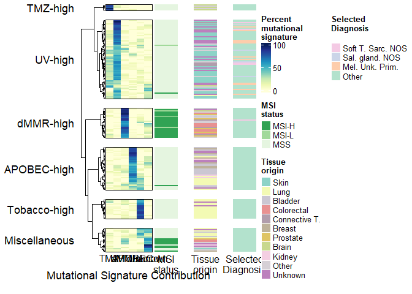<!-- -->


We originally set the number of clusters to 6 because we had 6 mutational signatures, however let's make sure it makes sense using the WSS and silhouette methods:


``` r
library(factoextra)
hc_method <- function (x,k) {
  hclust(x,k,hc_method="ward.D2")
}

fviz_nbclust(contribution_mat, hcut, method = "wss", k.max = 10) + 
  theme_minimal() + 
  ggtitle("WSS elbow method")
```

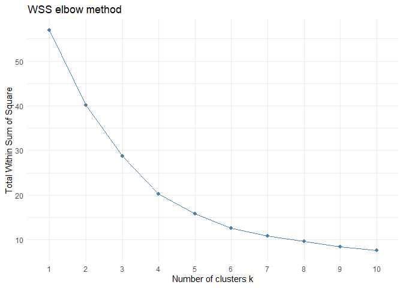<!-- -->

``` r
fviz_nbclust(contribution_mat, hcut, method = "silhouette", 
             k.max = 10) + 
  theme_minimal() +
  theme( plot.title = element_blank(),
        axis.title.x=element_text(size=15),
        axis.title.y=element_text(size=15),
        axis.text.x=element_text(size=15),
        axis.text.y=element_text(size=15))
```

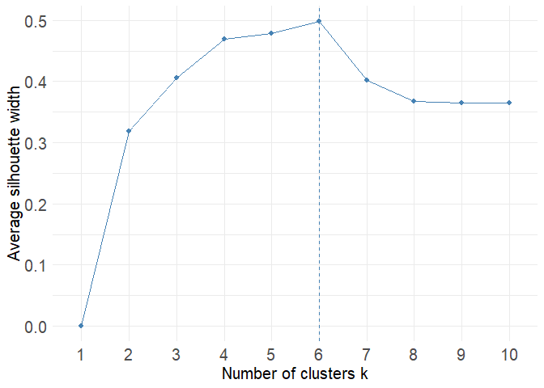<!-- -->

# Relationship between dMMR and MSI

We would like to see the relationship between the amount of TMB explained by dMMR and microsatellite status and number of indels. First let's the relevant information in a tibble


``` r
mmr_pct_tbl <- tibble (newid = rownames((contribution_mat)),
                   dmmr_pct = contribution_mat[,"dMMR"]) 

mmr_tbl <- high_tmb_df |>
  select(newid,microsatellite.instability.status,MutPerMB) |>
  dplyr::rename(MSI = microsatellite.instability.status)|>
  inner_join(mmr_pct_tbl) |>
  mutate(tmb_mmr=dmmr_pct*MutPerMB)
```

And let's look at the distribution of TMB from dMMR across MSS vs MSI-h


``` r
mmr_binary_tbl <- mmr_tbl |>
  filter(MSI!="MSI-L")
```


``` r
mmr_binary_tbl |>
  ggplot(aes(x=factor(MSI),y=dmmr_pct))+
  geom_boxplot()+
  theme_minimal()+
  scale_y_continuous(
    name="Fraction of mutations from dMMR signature")+
  scale_x_discrete("Microsatellite instability status") +
  theme(axis.title.x=element_text(size=15),
        axis.title.y=element_text(size=15),
        axis.text.x=element_text(size=12),
        axis.text.y=element_text(size=12))
```

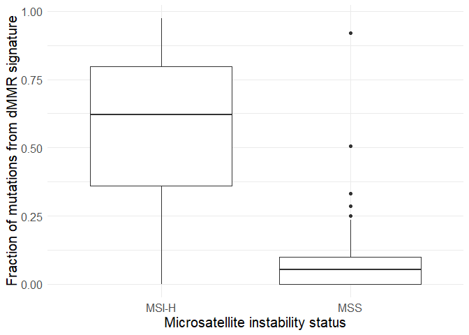<!-- -->

``` r
mosaic::favstats(dmmr_pct~MSI, data=mmr_binary_tbl)
```

```
##     MSI          min           Q1     median         Q3       max       mean
## 1 MSI-H 1.450416e-05 3.600637e-01 0.62058786 0.79799365 0.9741424 0.58815115
## 2   MSS 4.426191e-15 8.282225e-06 0.05382347 0.09842142 0.9206495 0.07320032
##          sd   n missing
## 1 0.2737006  31       0
## 2 0.1086491 133       0
```


# Exploring each cluster

Let's create a tibble with information about the clusters for each sample


``` r
num_signatures <- ncol(contribution_mat)
hc_sample <- hclust(dist(contribution_mat), 
                    method = cluster_method)
clusters <- cutree(hc_sample, k=numclusters)
cluster_names <- c("Misc.","APOBEC-high","Tobacco-high",
                   "UV-high","dMMR-high","TMZ-high")

cluster_levels <- c("TMZ-high","UV-high","dMMR-high",
                    "APOBEC-high","Tobacco-high","Misc.")

mut_process_tbl <- contribution_mat %>%
    as_tibble() %>%
    mutate(sample_id = rownames(contribution_mat)) %>%
    mutate(cluster_id = factor(cluster_names[clusters],
                               levels=cluster_levels))
```

And summarize the information by cluster:


``` r
mut_process_prop <- tableby(cluster_id ~ 
                        TMZ+UV+dMMR+APOBEC+Tobacco+Unknown,
                      data=mut_process_tbl, 
                      control=
                        tableby.control(test=FALSE, total=FALSE, 
                                        numeric.stats=
                                          c("meansd", "q1q3", "range")))
```


``` r
summary(mut_process_prop)
```


|                            | TMZ-high (N=5) | UV-high (N=66) | dMMR-high (N=25) | APOBEC-high (N=36) | Tobacco-high (N=16) | Misc. (N=20)  |
|:---------------------------|:--------------:|:--------------:|:----------------:|:------------------:|:-------------------:|:-------------:|
|**TMZ**                     |                |                |                  |                    |                     |               |
|&nbsp;&nbsp;&nbsp;Mean (SD) | 0.848 (0.088)  | 0.185 (0.139)  |  0.048 (0.068)   |   0.031 (0.057)    |    0.078 (0.093)    | 0.073 (0.061) |
|&nbsp;&nbsp;&nbsp;Q1, Q3    |  0.818, 0.828  |  0.060, 0.274  |   0.000, 0.086   |    0.000, 0.047    |    0.000, 0.079     | 0.030, 0.123  |
|&nbsp;&nbsp;&nbsp;Range     | 0.768 - 1.000  | 0.000 - 0.597  |  0.000 - 0.254   |   0.000 - 0.211    |    0.000 - 0.325    | 0.000 - 0.174 |
|**UV**                      |                |                |                  |                    |                     |               |
|&nbsp;&nbsp;&nbsp;Mean (SD) | 0.089 (0.090)  | 0.570 (0.181)  |  0.015 (0.022)   |   0.059 (0.067)    |    0.026 (0.036)    | 0.028 (0.062) |
|&nbsp;&nbsp;&nbsp;Q1, Q3    |  0.000, 0.173  |  0.451, 0.688  |   0.000, 0.024   |    0.000, 0.097    |    0.000, 0.053     | 0.000, 0.031  |
|&nbsp;&nbsp;&nbsp;Range     | 0.000 - 0.186  | 0.090 - 0.994  |  0.000 - 0.073   |   0.000 - 0.226    |    0.000 - 0.116    | 0.000 - 0.257 |
|**dMMR**                    |                |                |                  |                    |                     |               |
|&nbsp;&nbsp;&nbsp;Mean (SD) | 0.038 (0.038)  | 0.063 (0.086)  |  0.770 (0.133)   |   0.084 (0.091)    |    0.087 (0.071)    | 0.141 (0.145) |
|&nbsp;&nbsp;&nbsp;Q1, Q3    |  0.000, 0.061  |  0.000, 0.090  |   0.625, 0.884   |    0.000, 0.120    |    0.042, 0.132     | 0.000, 0.206  |
|&nbsp;&nbsp;&nbsp;Range     | 0.000 - 0.084  | 0.000 - 0.507  |  0.559 - 0.974   |   0.000 - 0.333    |    0.000 - 0.231    | 0.000 - 0.430 |
|**APOBEC**                  |                |                |                  |                    |                     |               |
|&nbsp;&nbsp;&nbsp;Mean (SD) | 0.024 (0.054)  | 0.043 (0.069)  |  0.016 (0.024)   |   0.610 (0.188)    |    0.039 (0.046)    | 0.041 (0.060) |
|&nbsp;&nbsp;&nbsp;Q1, Q3    |  0.000, 0.000  |  0.000, 0.070  |   0.000, 0.031   |    0.478, 0.738    |    0.000, 0.070     | 0.000, 0.059  |
|&nbsp;&nbsp;&nbsp;Range     | 0.000 - 0.121  | 0.000 - 0.310  |  0.000 - 0.075   |   0.155 - 0.915    |    0.000 - 0.137    | 0.000 - 0.185 |
|**Tobacco**                 |                |                |                  |                    |                     |               |
|&nbsp;&nbsp;&nbsp;Mean (SD) | 0.000 (0.000)  | 0.060 (0.080)  |  0.050 (0.083)   |   0.144 (0.164)    |    0.749 (0.113)    | 0.220 (0.206) |
|&nbsp;&nbsp;&nbsp;Q1, Q3    |  0.000, 0.000  |  0.000, 0.098  |   0.000, 0.082   |    0.000, 0.272    |    0.663, 0.832     | 0.001, 0.373  |
|&nbsp;&nbsp;&nbsp;Range     | 0.000 - 0.000  | 0.000 - 0.345  |  0.000 - 0.339   |   0.000 - 0.463    |    0.492 - 0.869    | 0.000 - 0.582 |
|**Unknown**                 |                |                |                  |                    |                     |               |
|&nbsp;&nbsp;&nbsp;Mean (SD) | 0.000 (0.000)  | 0.078 (0.119)  |  0.101 (0.123)   |   0.073 (0.107)    |    0.020 (0.038)    | 0.497 (0.211) |
|&nbsp;&nbsp;&nbsp;Q1, Q3    |  0.000, 0.000  |  0.000, 0.121  |   0.000, 0.174   |    0.000, 0.135    |    0.000, 0.012     | 0.391, 0.592  |
|&nbsp;&nbsp;&nbsp;Range     | 0.000 - 0.000  | 0.000 - 0.470  |  0.000 - 0.425   |   0.000 - 0.386    |    0.000 - 0.101    | 0.153 - 0.999 |


For each of our clusters we find the mutational profile center by adding the counts corresponding to each dinucleotide context:


``` r
cons_tbl <- data.frame(matrix(0, ncol =numclusters, nrow = 96))
colnames(cons_tbl) <- seq(1,numclusters)
row.names(cons_tbl) <- row.names(nmf_res$signatures)

for (i in 1:numclusters) {
    sample_ids <- names(clusters[clusters==i])
    cons_tbl[,i] <- rowSums(mut_mat[,sample_ids])
}
colnames(cons_tbl)=cluster_names
```


And we create our supplementary figures 4


``` r
plot_96_profile(cons_tbl)
```

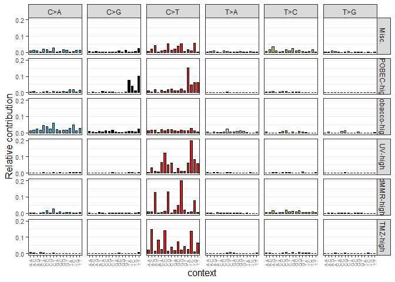<!-- -->

# Cluster description

We start by joining the mutational signature information from `mut_process_tbl` into the clinical information from `clinical_tbl`


``` r
nclinical_tbl <- high_tmb_df %>%
  inner_join(mut_process_tbl, by = join_by(newid==sample_id)) %>%
  arrange(cluster_id)
```


Let's get a table of TMB for the five designated clusters and get some summaries


``` r
cluster_levels <- c("TMZ-high","UV-high","dMMR-high",
                    "APOBEC-high","Tobacco-high")
tmb_clinical_tbl <- nclinical_tbl %>%
  filter(cluster_id != 'Misc.') |>
  mutate(cluster_id = factor(cluster_id,levels=cluster_levels))

cluster_tbl <- tableby(cluster_id ~  MutPerMB ,
                data=tmb_clinical_tbl, 
                total=FALSE,
                control=tableby.control(test=TRUE, total=TRUE, 
                                        numeric.stats=c("meansd", "median","q1q3", "range")))


labels(cluster_tbl) <-  c(MutPerMB="Mut/Mb")


summary(cluster_tbl, digits=1, 
        digits.p=4, digits.pct=0, pfootnote=TRUE)
```


|                            | TMZ-high (N=5) | UV-high (N=66) | dMMR-high (N=25) | APOBEC-high (N=36) | Tobacco-high (N=16) |    p value|
|:---------------------------|:--------------:|:--------------:|:----------------:|:------------------:|:-------------------:|----------:|
|**Mut/Mb**                  |                |                |                  |                    |                     | < 1e-04^1^|
|&nbsp;&nbsp;&nbsp;Mean (SD) |  80.0 (53.3)   |  58.0 (30.6)   |   44.5 (18.0)    |    35.0 (15.4)     |     29.8 (11.6)     |           |
|&nbsp;&nbsp;&nbsp;Median    |      68.0      |      50.0      |       42.0       |        28.0        |        25.0         |           |
|&nbsp;&nbsp;&nbsp;Q1, Q3    |   43.0, 81.0   |   32.2, 76.0   |    28.0, 53.0    |     23.8, 48.5     |     22.5, 31.0      |           |
|&nbsp;&nbsp;&nbsp;Range     |  38.0 - 170.0  |  20.0 - 146.0  |   21.0 - 95.0    |    20.0 - 74.0     |     20.0 - 57.0     |           |
1. Linear Model ANOVA

We can visualize the data using the following plot


``` r
ggplot(tmb_clinical_tbl, aes(x=cluster_id, y=MutPerMB))+
       geom_boxplot()+
       geom_dotplot(binaxis = "y", stackdir = "center", dotsize=.6)+
       scale_y_log10(name="Mutations per MB",limits=c(10,300))+
       scale_x_discrete(name="Cluster") +
       theme_minimal()+
       theme(axis.title.x=element_text(size=20),
             axis.title.y=element_text(size=20),
             axis.text.x=element_text(size=15),
             axis.text.y=element_text(size=15))
```

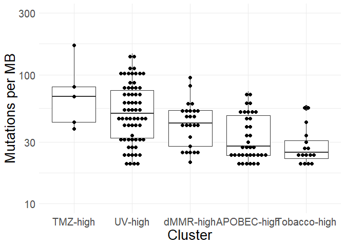<!-- -->

And below we can see the results for the linear model on the log10 TMB for each of the named cluster


``` r
cluster_levels <- c("TMZ-high","UV-high","dMMR-high",
                    "APOBEC-high","Tobacco-high")
tmb_clinical_tbl <- tmb_clinical_tbl |>
  mutate(cluster_id = factor(cluster_id, levels=rev(cluster_levels)))

tmb_model <- lm(log10(MutPerMB)~cluster_id,tmb_clinical_tbl)
summary(tmb_model)
```

```
## 
## Call:
## lm(formula = log10(MutPerMB) ~ cluster_id, data = tmb_clinical_tbl)
## 
## Residuals:
##      Min       1Q   Median       3Q      Max 
## -0.40314 -0.14622 -0.02293  0.15614  0.46018 
## 
## Coefficients:
##                       Estimate Std. Error t value Pr(>|t|)    
## (Intercept)            1.44864    0.05053  28.669  < 2e-16 ***
## cluster_idAPOBEC-high  0.05931    0.06073   0.977 0.330431    
## cluster_iddMMR-high    0.16708    0.06471   2.582 0.010829 *  
## cluster_idUV-high      0.25553    0.05632   4.537  1.2e-05 ***
## cluster_idTMZ-high     0.38830    0.10356   3.750 0.000256 ***
## ---
## Signif. codes:  0 '***' 0.001 '**' 0.01 '*' 0.05 '.' 0.1 ' ' 1
## 
## Residual standard error: 0.2021 on 143 degrees of freedom
## Multiple R-squared:  0.2176,	Adjusted R-squared:  0.1957 
## F-statistic: 9.943 on 4 and 143 DF,  p-value: 3.972e-07
```

``` r
par(mfrow=c(2,2)) # Change the panel layout to 2 x 2
plot(tmb_model)
```

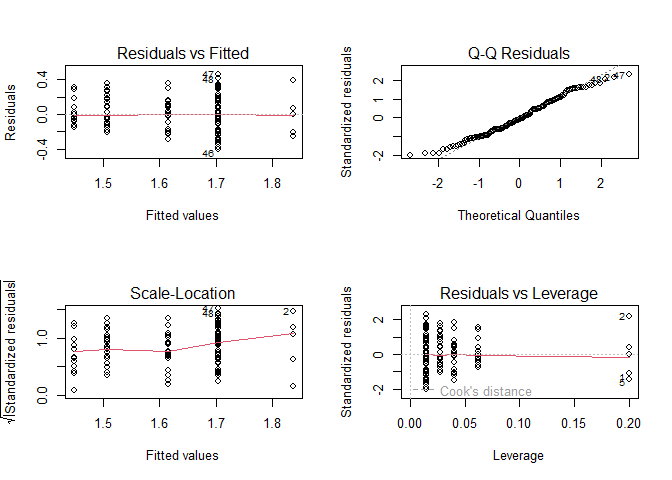<!-- -->

``` r
par(mfrow=c(1,1))

conf_tbl <- 10^confint(tmb_model) |>
  as_tibble()
library(broom)
tidy(tmb_model) |>
  select(term,estimate,p.value) |>
  mutate(estimate=10^estimate) |>
  cbind(conf_tbl) |>
  mutate(term=str_replace(term,"cluster_id","")) |>
  mutate(term=str_replace(term,"\\(Intercept\\)","Tobacco-high")) |>
  mutate(estimate = format(estimate,digits=2, nsmall=0),
         p.value = format(p.value, digits=2, scientific=TRUE),
         `2.5 %` = format(`2.5 %`,digits=2, nsmall=0),
         `97.5 %` = format(`97.5 %`,digits=3, nsmall=0)) |>
  kbl() |>
  kable_styling() 
```

<table class="table" style="margin-left: auto; margin-right: auto;">
 <thead>
  <tr>
   <th style="text-align:left;"> term </th>
   <th style="text-align:left;"> estimate </th>
   <th style="text-align:left;"> p.value </th>
   <th style="text-align:left;"> 2.5 % </th>
   <th style="text-align:left;"> 97.5 % </th>
  </tr>
 </thead>
<tbody>
  <tr>
   <td style="text-align:left;"> Tobacco-high </td>
   <td style="text-align:left;"> 28.1 </td>
   <td style="text-align:left;"> 3.8e-61 </td>
   <td style="text-align:left;"> 22.32 </td>
   <td style="text-align:left;"> 35.36 </td>
  </tr>
  <tr>
   <td style="text-align:left;"> APOBEC-high </td>
   <td style="text-align:left;"> 1.1 </td>
   <td style="text-align:left;"> 3.3e-01 </td>
   <td style="text-align:left;"> 0.87 </td>
   <td style="text-align:left;"> 1.51 </td>
  </tr>
  <tr>
   <td style="text-align:left;"> dMMR-high </td>
   <td style="text-align:left;"> 1.5 </td>
   <td style="text-align:left;"> 1.1e-02 </td>
   <td style="text-align:left;"> 1.09 </td>
   <td style="text-align:left;"> 1.97 </td>
  </tr>
  <tr>
   <td style="text-align:left;"> UV-high </td>
   <td style="text-align:left;"> 1.8 </td>
   <td style="text-align:left;"> 1.2e-05 </td>
   <td style="text-align:left;"> 1.39 </td>
   <td style="text-align:left;"> 2.33 </td>
  </tr>
  <tr>
   <td style="text-align:left;"> TMZ-high </td>
   <td style="text-align:left;"> 2.4 </td>
   <td style="text-align:left;"> 2.6e-04 </td>
   <td style="text-align:left;"> 1.53 </td>
   <td style="text-align:left;"> 3.92 </td>
  </tr>
</tbody>
</table>

# Cluster and MSI-H

We first establish the p-value of the association between dMMR-high and MSI-H


``` r
mss_vs_msih_table <- nclinical_tbl |>
 mutate(microsatellite.instability.status = 
          if_else(microsatellite.instability.status=="MSI-H",
                  "MSI-H","other")) |>
  mutate(cluster_id = if_else(cluster_id=="dMMR-high",
                              "dMMR-high","other"))


table(mss_vs_msih_table$microsatellite.instability.status, 
      mss_vs_msih_table$cluster_id) |>
  fisher.test()
```

```
## 
## 	Fisher's Exact Test for Count Data
## 
## data:  table(mss_vs_msih_table$microsatellite.instability.status, mss_vs_msih_table$cluster_id)
## p-value = 1.494e-15
## alternative hypothesis: true odds ratio is not equal to 1
## 95 percent confidence interval:
##   17.93291 314.43340
## sample estimates:
## odds ratio 
##   65.72798
```


# Clusters and tissue of origin

For each of the cluster we can summarize the tissue type where it originated:


``` r
ntissue_levels <- c("unknown",tissue_levels[1:length(tissue_levels)-1])
cluster_levels <- c("UV-high","Tobacco-high","TMZ-high",
                    "APOBEC-high","dMMR-high")


nclinical_tbl <- nclinical_tbl %>%
  filter(cluster_id!="Miscellaneous") |>
  mutate(primary.tissue  = str_replace(primary.tissue,"unknown primary", "unknown")) %>%
  mutate(primary.tissue=factor(primary.tissue,levels=ntissue_levels))  %>%
  mutate(cluster_id = factor(cluster_id, levels=cluster_levels))
  

cluster_tbl_tissue <- tableby(cluster_id ~ primary.tissue ,
                        data=nclinical_tbl, 
                        control=
                          tableby.control(test=FALSE, total=TRUE, 
                                        numeric.stats=c("Nmiss", "meansd", "q1q3", "range")))

labels(cluster_tbl_tissue) <-  c(primary.tissue="Primary site")

summary(cluster_tbl_tissue, digits.pct=0)
```


|                                | UV-high (N=66) | Tobacco-high (N=16) | TMZ-high (N=5) | APOBEC-high (N=36) | dMMR-high (N=25) | Total (N=148) |
|:-------------------------------|:--------------:|:-------------------:|:--------------:|:------------------:|:----------------:|:-------------:|
|**Primary site**                |                |                     |                |                    |                  |               |
|&nbsp;&nbsp;&nbsp;unknown       |    17 (26%)    |       2 (12%)       |     0 (0%)     |      5 (14%)       |      1 (4%)      |   25 (17%)    |
|&nbsp;&nbsp;&nbsp;skin          |    34 (52%)    |       0 (0%)        |     0 (0%)     |       0 (0%)       |      0 (0%)      |   34 (23%)    |
|&nbsp;&nbsp;&nbsp;lung          |     1 (2%)     |      14 (88%)       |     0 (0%)     |      9 (25%)       |      0 (0%)      |   24 (16%)    |
|&nbsp;&nbsp;&nbsp;bladder       |     0 (0%)     |       0 (0%)        |     0 (0%)     |      11 (31%)      |      2 (8%)      |    13 (9%)    |
|&nbsp;&nbsp;&nbsp;colorectal    |     0 (0%)     |       0 (0%)        |     0 (0%)     |       0 (0%)       |     7 (28%)      |    7 (5%)     |
|&nbsp;&nbsp;&nbsp;connective t. |     6 (9%)     |       0 (0%)        |     0 (0%)     |       0 (0%)       |     3 (12%)      |    9 (6%)     |
|&nbsp;&nbsp;&nbsp;breast        |     0 (0%)     |       0 (0%)        |     0 (0%)     |      6 (17%)       |      0 (0%)      |    6 (4%)     |
|&nbsp;&nbsp;&nbsp;prostate      |     0 (0%)     |       0 (0%)        |     0 (0%)     |       0 (0%)       |     5 (20%)      |    5 (3%)     |
|&nbsp;&nbsp;&nbsp;brain         |     1 (2%)     |       0 (0%)        |    3 (60%)     |       0 (0%)       |      1 (4%)      |    5 (3%)     |
|&nbsp;&nbsp;&nbsp;kidney        |     0 (0%)     |       0 (0%)        |     0 (0%)     |       3 (8%)       |      0 (0%)      |    3 (2%)     |
|&nbsp;&nbsp;&nbsp;other         |    7 (11%)     |       0 (0%)        |    2 (40%)     |       2 (6%)       |     6 (24%)      |   17 (11%)    |

If we exclude "unknown" tissue types we have 2 clusters where one tissue has over 60%  (Tobacco-High and UV-high)


We are interested in calculating a p-value for the association of a particular tissue in a particular cluster


``` r
# We calculate the p-value of the proportion of cases from most abundant
# tissue in each cluster
calc_tissue_pvalue <- function (clusterid, clinical_tbl) {
  
  #Determine most abundant primary tissue in the cluster
  max_tissue <- clinical_tbl %>% 
    filter (cluster_id == clusterid) %>% 
    filter (primary.tissue!="unknown primary") %>%
    dplyr::count(primary.tissue) %>% 
    dplyr::slice_max(n) %>%
    pull(primary.tissue)
  
  test_tbl <- clinical_tbl %>%
    mutate(iscluster = if_else(cluster_id==clusterid,1,0)) %>%
    mutate(istissue = if_else(primary.tissue==max_tissue,1,0))
  
  fisher.test(table(test_tbl$iscluster,test_tbl$istissue))$p.value
}
```

And we calculate the p-value of the association for UV-high and Tobacco-high


``` r
calc_tissue_pvalue("UV-high",nclinical_tbl)
```

```
## [1] 2.058394e-15
```

``` r
calc_tissue_pvalue("Tobacco-high",nclinical_tbl)
```

```
## [1] 1.383811e-11
```


## Unknown origin

All of the cases:


``` r
nclinical_tbl %>%
  filter(primary.tissue == "unknown") %>%
  dplyr::arrange(cluster_id) %>%
  select(newid,primary.tissue,SubmittedDiagnosis,
         cluster_id,MutPerMB) %>%
  kbl() %>%
  kable_styling()
```

<table class="table" style="margin-left: auto; margin-right: auto;">
 <thead>
  <tr>
   <th style="text-align:left;"> newid </th>
   <th style="text-align:left;"> primary.tissue </th>
   <th style="text-align:left;"> SubmittedDiagnosis </th>
   <th style="text-align:left;"> cluster_id </th>
   <th style="text-align:right;"> MutPerMB </th>
  </tr>
 </thead>
<tbody>
  <tr>
   <td style="text-align:left;"> F00434 </td>
   <td style="text-align:left;"> unknown </td>
   <td style="text-align:left;"> Unknown primary melanoma </td>
   <td style="text-align:left;"> UV-high </td>
   <td style="text-align:right;"> 98 </td>
  </tr>
  <tr>
   <td style="text-align:left;"> F00520 </td>
   <td style="text-align:left;"> unknown </td>
   <td style="text-align:left;"> Unknown primary carcinoma (NOS) </td>
   <td style="text-align:left;"> UV-high </td>
   <td style="text-align:right;"> 21 </td>
  </tr>
  <tr>
   <td style="text-align:left;"> F00530 </td>
   <td style="text-align:left;"> unknown </td>
   <td style="text-align:left;"> Unknown primary neuroendocrine tumor (NET) </td>
   <td style="text-align:left;"> UV-high </td>
   <td style="text-align:right;"> 33 </td>
  </tr>
  <tr>
   <td style="text-align:left;"> F00779 </td>
   <td style="text-align:left;"> unknown </td>
   <td style="text-align:left;"> Unknown primary melanoma </td>
   <td style="text-align:left;"> UV-high </td>
   <td style="text-align:right;"> 48 </td>
  </tr>
  <tr>
   <td style="text-align:left;"> F00865 </td>
   <td style="text-align:left;"> unknown </td>
   <td style="text-align:left;"> Unknown primary melanoma </td>
   <td style="text-align:left;"> UV-high </td>
   <td style="text-align:right;"> 23 </td>
  </tr>
  <tr>
   <td style="text-align:left;"> F00925 </td>
   <td style="text-align:left;"> unknown </td>
   <td style="text-align:left;"> Unknown primary squamous cell carcinoma (SCC) </td>
   <td style="text-align:left;"> UV-high </td>
   <td style="text-align:right;"> 42 </td>
  </tr>
  <tr>
   <td style="text-align:left;"> F01040 </td>
   <td style="text-align:left;"> unknown </td>
   <td style="text-align:left;"> Unknown primary melanoma </td>
   <td style="text-align:left;"> UV-high </td>
   <td style="text-align:right;"> 26 </td>
  </tr>
  <tr>
   <td style="text-align:left;"> F01072 </td>
   <td style="text-align:left;"> unknown </td>
   <td style="text-align:left;"> Unknown primary melanoma </td>
   <td style="text-align:left;"> UV-high </td>
   <td style="text-align:right;"> 52 </td>
  </tr>
  <tr>
   <td style="text-align:left;"> F01112 </td>
   <td style="text-align:left;"> unknown </td>
   <td style="text-align:left;"> Unknown primary melanoma </td>
   <td style="text-align:left;"> UV-high </td>
   <td style="text-align:right;"> 25 </td>
  </tr>
  <tr>
   <td style="text-align:left;"> F01898 </td>
   <td style="text-align:left;"> unknown </td>
   <td style="text-align:left;"> Unknown primary melanoma </td>
   <td style="text-align:left;"> UV-high </td>
   <td style="text-align:right;"> 25 </td>
  </tr>
  <tr>
   <td style="text-align:left;"> F02015 </td>
   <td style="text-align:left;"> unknown </td>
   <td style="text-align:left;"> Unknown primary melanoma </td>
   <td style="text-align:left;"> UV-high </td>
   <td style="text-align:right;"> 34 </td>
  </tr>
  <tr>
   <td style="text-align:left;"> F02056 </td>
   <td style="text-align:left;"> unknown </td>
   <td style="text-align:left;"> Unknown primary melanoma </td>
   <td style="text-align:left;"> UV-high </td>
   <td style="text-align:right;"> 46 </td>
  </tr>
  <tr>
   <td style="text-align:left;"> F02262 </td>
   <td style="text-align:left;"> unknown </td>
   <td style="text-align:left;"> Unknown primary squamous cell carcinoma (SCC) </td>
   <td style="text-align:left;"> UV-high </td>
   <td style="text-align:right;"> 63 </td>
  </tr>
  <tr>
   <td style="text-align:left;"> F02382 </td>
   <td style="text-align:left;"> unknown </td>
   <td style="text-align:left;"> Unknown primary melanoma </td>
   <td style="text-align:left;"> UV-high </td>
   <td style="text-align:right;"> 63 </td>
  </tr>
  <tr>
   <td style="text-align:left;"> F02500 </td>
   <td style="text-align:left;"> unknown </td>
   <td style="text-align:left;"> Unknown primary melanoma </td>
   <td style="text-align:left;"> UV-high </td>
   <td style="text-align:right;"> 61 </td>
  </tr>
  <tr>
   <td style="text-align:left;"> F02550 </td>
   <td style="text-align:left;"> unknown </td>
   <td style="text-align:left;"> Unknown primary squamous cell carcinoma (SCC) </td>
   <td style="text-align:left;"> UV-high </td>
   <td style="text-align:right;"> 81 </td>
  </tr>
  <tr>
   <td style="text-align:left;"> F03718 </td>
   <td style="text-align:left;"> unknown </td>
   <td style="text-align:left;"> Unknown primary squamous cell carcinoma (SCC) </td>
   <td style="text-align:left;"> UV-high </td>
   <td style="text-align:right;"> 32 </td>
  </tr>
  <tr>
   <td style="text-align:left;"> F00155 </td>
   <td style="text-align:left;"> unknown </td>
   <td style="text-align:left;"> Unknown primary undifferentiated neuroendocrine carcinoma </td>
   <td style="text-align:left;"> Tobacco-high </td>
   <td style="text-align:right;"> 28 </td>
  </tr>
  <tr>
   <td style="text-align:left;"> F03627 </td>
   <td style="text-align:left;"> unknown </td>
   <td style="text-align:left;"> Unknown primary carcinoma (NOS) </td>
   <td style="text-align:left;"> Tobacco-high </td>
   <td style="text-align:right;"> 24 </td>
  </tr>
  <tr>
   <td style="text-align:left;"> F00685 </td>
   <td style="text-align:left;"> unknown </td>
   <td style="text-align:left;"> Unknown primary carcinoma (NOS) </td>
   <td style="text-align:left;"> APOBEC-high </td>
   <td style="text-align:right;"> 24 </td>
  </tr>
  <tr>
   <td style="text-align:left;"> F01837 </td>
   <td style="text-align:left;"> unknown </td>
   <td style="text-align:left;"> Unknown primary urothelial carcinoma </td>
   <td style="text-align:left;"> APOBEC-high </td>
   <td style="text-align:right;"> 20 </td>
  </tr>
  <tr>
   <td style="text-align:left;"> F03182 </td>
   <td style="text-align:left;"> unknown </td>
   <td style="text-align:left;"> Unknown primary urothelial carcinoma </td>
   <td style="text-align:left;"> APOBEC-high </td>
   <td style="text-align:right;"> 34 </td>
  </tr>
  <tr>
   <td style="text-align:left;"> F03498 </td>
   <td style="text-align:left;"> unknown </td>
   <td style="text-align:left;"> Unknown primary urothelial carcinoma </td>
   <td style="text-align:left;"> APOBEC-high </td>
   <td style="text-align:right;"> 53 </td>
  </tr>
  <tr>
   <td style="text-align:left;"> F03655 </td>
   <td style="text-align:left;"> unknown </td>
   <td style="text-align:left;"> Unknown primary urothelial carcinoma </td>
   <td style="text-align:left;"> APOBEC-high </td>
   <td style="text-align:right;"> 34 </td>
  </tr>
  <tr>
   <td style="text-align:left;"> F03144 </td>
   <td style="text-align:left;"> unknown </td>
   <td style="text-align:left;"> Unknown primary adenocarcinoma </td>
   <td style="text-align:left;"> dMMR-high </td>
   <td style="text-align:right;"> 53 </td>
  </tr>
  <tr>
   <td style="text-align:left;"> F00401 </td>
   <td style="text-align:left;"> unknown </td>
   <td style="text-align:left;"> Unknown primary carcinoma (NOS) </td>
   <td style="text-align:left;"> NA </td>
   <td style="text-align:right;"> 39 </td>
  </tr>
  <tr>
   <td style="text-align:left;"> F02244 </td>
   <td style="text-align:left;"> unknown </td>
   <td style="text-align:left;"> Unknown primary undifferentiated neuroendocrine carcinoma </td>
   <td style="text-align:left;"> NA </td>
   <td style="text-align:right;"> 25 </td>
  </tr>
  <tr>
   <td style="text-align:left;"> F02701 </td>
   <td style="text-align:left;"> unknown </td>
   <td style="text-align:left;"> Unknown primary adenocarcinoma </td>
   <td style="text-align:left;"> NA </td>
   <td style="text-align:right;"> 69 </td>
  </tr>
</tbody>
</table>

Summary of the UV and Tobacco cases


``` r
nclinical_tbl %>%
  dplyr::filter (cluster_id=="UV-high" | cluster_id=="Tobacco-high") |>
  dplyr::filter(primary.tissue == "unknown") |>
  dplyr::count(SubmittedDiagnosis) |>
  arrange(-n) |>
  kbl() %>%
  kable_styling()
```

<table class="table" style="margin-left: auto; margin-right: auto;">
 <thead>
  <tr>
   <th style="text-align:left;"> SubmittedDiagnosis </th>
   <th style="text-align:right;"> n </th>
  </tr>
 </thead>
<tbody>
  <tr>
   <td style="text-align:left;"> Unknown primary melanoma </td>
   <td style="text-align:right;"> 11 </td>
  </tr>
  <tr>
   <td style="text-align:left;"> Unknown primary squamous cell carcinoma (SCC) </td>
   <td style="text-align:right;"> 4 </td>
  </tr>
  <tr>
   <td style="text-align:left;"> Unknown primary carcinoma (NOS) </td>
   <td style="text-align:right;"> 2 </td>
  </tr>
  <tr>
   <td style="text-align:left;"> Unknown primary neuroendocrine tumor (NET) </td>
   <td style="text-align:right;"> 1 </td>
  </tr>
  <tr>
   <td style="text-align:left;"> Unknown primary undifferentiated neuroendocrine carcinoma </td>
   <td style="text-align:right;"> 1 </td>
  </tr>
</tbody>
</table>


## Melanoma of unknown primary

Let's find out how many cases of melanoma unknow-primary are and in what cluster they are:


``` r
nclinical_tbl %>%
  filter(other.dx == 'Mel. Unk. Prim.') %>%
  dplyr::count(cluster_id)
```

```
## # A tibble: 1 × 2
##   cluster_id     n
##   <fct>      <int>
## 1 UV-high       11
```

Summary:


``` r
nclinical_tbl %>%
  filter(other.dx == 'Mel. Unk. Prim.') %>%
  dplyr::count(SubmittedDiagnosis)
```

```
## # A tibble: 1 × 2
##   SubmittedDiagnosis           n
##   <chr>                    <int>
## 1 Unknown primary melanoma    11
```


And here is a breakdown


``` r
nclinical_tbl %>%
  filter(other.dx == 'Mel. Unk. Prim.') %>%
  dplyr::arrange(cluster_id) %>%
  select(newid,primary.tissue,SubmittedDiagnosis,
         cluster_id,MutPerMB) %>%
  kbl() %>%
  kable_styling()
```

<table class="table" style="margin-left: auto; margin-right: auto;">
 <thead>
  <tr>
   <th style="text-align:left;"> newid </th>
   <th style="text-align:left;"> primary.tissue </th>
   <th style="text-align:left;"> SubmittedDiagnosis </th>
   <th style="text-align:left;"> cluster_id </th>
   <th style="text-align:right;"> MutPerMB </th>
  </tr>
 </thead>
<tbody>
  <tr>
   <td style="text-align:left;"> F00434 </td>
   <td style="text-align:left;"> unknown </td>
   <td style="text-align:left;"> Unknown primary melanoma </td>
   <td style="text-align:left;"> UV-high </td>
   <td style="text-align:right;"> 98 </td>
  </tr>
  <tr>
   <td style="text-align:left;"> F00779 </td>
   <td style="text-align:left;"> unknown </td>
   <td style="text-align:left;"> Unknown primary melanoma </td>
   <td style="text-align:left;"> UV-high </td>
   <td style="text-align:right;"> 48 </td>
  </tr>
  <tr>
   <td style="text-align:left;"> F00865 </td>
   <td style="text-align:left;"> unknown </td>
   <td style="text-align:left;"> Unknown primary melanoma </td>
   <td style="text-align:left;"> UV-high </td>
   <td style="text-align:right;"> 23 </td>
  </tr>
  <tr>
   <td style="text-align:left;"> F01040 </td>
   <td style="text-align:left;"> unknown </td>
   <td style="text-align:left;"> Unknown primary melanoma </td>
   <td style="text-align:left;"> UV-high </td>
   <td style="text-align:right;"> 26 </td>
  </tr>
  <tr>
   <td style="text-align:left;"> F01072 </td>
   <td style="text-align:left;"> unknown </td>
   <td style="text-align:left;"> Unknown primary melanoma </td>
   <td style="text-align:left;"> UV-high </td>
   <td style="text-align:right;"> 52 </td>
  </tr>
  <tr>
   <td style="text-align:left;"> F01112 </td>
   <td style="text-align:left;"> unknown </td>
   <td style="text-align:left;"> Unknown primary melanoma </td>
   <td style="text-align:left;"> UV-high </td>
   <td style="text-align:right;"> 25 </td>
  </tr>
  <tr>
   <td style="text-align:left;"> F01898 </td>
   <td style="text-align:left;"> unknown </td>
   <td style="text-align:left;"> Unknown primary melanoma </td>
   <td style="text-align:left;"> UV-high </td>
   <td style="text-align:right;"> 25 </td>
  </tr>
  <tr>
   <td style="text-align:left;"> F02015 </td>
   <td style="text-align:left;"> unknown </td>
   <td style="text-align:left;"> Unknown primary melanoma </td>
   <td style="text-align:left;"> UV-high </td>
   <td style="text-align:right;"> 34 </td>
  </tr>
  <tr>
   <td style="text-align:left;"> F02056 </td>
   <td style="text-align:left;"> unknown </td>
   <td style="text-align:left;"> Unknown primary melanoma </td>
   <td style="text-align:left;"> UV-high </td>
   <td style="text-align:right;"> 46 </td>
  </tr>
  <tr>
   <td style="text-align:left;"> F02382 </td>
   <td style="text-align:left;"> unknown </td>
   <td style="text-align:left;"> Unknown primary melanoma </td>
   <td style="text-align:left;"> UV-high </td>
   <td style="text-align:right;"> 63 </td>
  </tr>
  <tr>
   <td style="text-align:left;"> F02500 </td>
   <td style="text-align:left;"> unknown </td>
   <td style="text-align:left;"> Unknown primary melanoma </td>
   <td style="text-align:left;"> UV-high </td>
   <td style="text-align:right;"> 61 </td>
  </tr>
</tbody>
</table>


And let's calculate the p-value


``` r
mup_table <- nclinical_tbl |>
mutate(mup=if_else(other.dx=='Mel. Unk. Prim.', "Yes","No"))


table(mup_table$mup, 
      mup_table$cluster_id) |>
  fisher.test()
```

```
## 
## 	Fisher's Exact Test for Count Data
## 
## data:  table(mup_table$mup, mup_table$cluster_id)
## p-value = 0.008286
## alternative hypothesis: two.sided
```


## Tables

Table with high tmb cases:


``` r
nclinical_tbl |>
  select(newid,cluster_id,TMZ,UV,dMMR, APOBEC, Tobacco, Unknown,
         primary.tissue,other.dx,SubmittedDiagnosis,
         MutPerMB,microsatellite.instability.status) |>
  write_csv("high_tmb_cases.csv")
```

